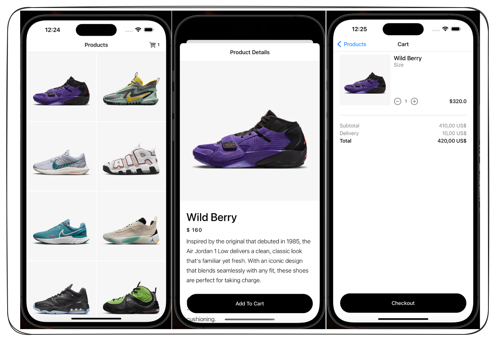

## Nike Ecommerce App

### Résumé du Projet : NikeApp Shop

Le projet **NikeApp Shop** est une application mobile créée avec React Native, conçue pour offrir une expérience utilisateur fluide dans l'achat de chaussures de sport. L'application permet aux utilisateurs de parcourir des collections de chaussures, consulter les détails des produits, et gérer leur panier d'achat. Avec une architecture moderne utilisant Redux pour la gestion d'état et une navigation efficace, cette application est idéale pour une boutique en ligne.

### Structure des Dossiers et Fichiers

- **`assets`** :

  - Contient les ressources visuelles, comme les images et les icônes utilisées dans l'application.

- **`readme.md`** :

  - Documentation qui explique le projet, ses fonctionnalités, et comment le configurer ou l'exécuter.

- **`package-lock.json`** :

  - Assure que toutes les dépendances du projet sont installées avec des versions cohérentes.

- **`babel.config.js`** :

  - Configure Babel pour compiler le code JavaScript de manière compatible avec différents environnements.

- **`app.json`** :

  - Fournit les métadonnées de l'application, comme le nom, le slug, et les configurations spécifiques à Expo.

- **`app.js`** :

  - Point d'entrée principal de l'application, où les composants clés, comme la navigation et le store Redux, sont intégrés.

- **`.gitignore`** :

  - Liste les fichiers à exclure du suivi Git (ex. : fichiers temporaires, `node_modules`).

- **`src`** :
  - Contient le cœur logique de l'application.

---

### Structure du Dossier `src`

- **`components`** :

  - **`cartListItem.js`** :
    - Composant qui représente un article individuel dans le panier d'achat. Il affiche les informations essentielles (nom, prix, quantité) et offre des options pour ajuster la quantité ou supprimer un produit.

- **`data`** :

  - **`cart.js`** :
    - Contient des données ou des mock-ups pour les articles du panier, simulant les articles ajoutés par l'utilisateur.
  - **`products.js`** :
    - Fichier contenant les données statiques ou simulées des produits disponibles dans le magasin.

- **`screens`** :

  - **`productDetailsScreen.js`** :
    - Gère l'affichage des détails d'un produit spécifique, comme les images, la description, le prix, et les options d'achat.
  - **`productScreen.js`** :
    - Affiche la liste des produits disponibles dans le magasin.
  - **`shoppingCart.js`** :
    - Écran principal pour afficher les articles ajoutés au panier, permettant de gérer la commande.

- **`store`** :

  - **`cartSlice.js`** :
    - Définit la logique Redux pour la gestion des articles dans le panier (ajout, suppression, mise à jour des quantités).
  - **`index.js`** :
    - Configure le store Redux et combine les différentes slices (cart, products, etc.).
  - **`productsSlice.js`** :
    - Contient la logique Redux pour la gestion des produits (chargement, filtrage, ou autres interactions).

- **`navigation.js`** :
  - Fichier qui configure la navigation entre les différents écrans de l'application (ex. : Home, Détails du produit, Panier).

---

### Résumé

La structure modulaire et bien organisée de **NikeApp Shop** garantit un code maintenable et évolutif. Chaque fichier et dossier a une fonction spécifique, que ce soit pour gérer les écrans, les composants réutilisables, ou les données. Avec Redux pour une gestion centralisée de l'état et une navigation fluide, ce projet constitue une base solide pour un magasin en ligne moderne.
